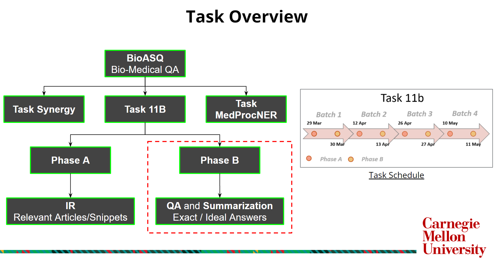

# ASQAway
This is the code repository of ASQAway team, participating in the [BioASQ Task 11b Phase B](http://participants-area.bioasq.org/general_information/Task11b/) challenge.

## Proposed Methodolog
* Focus on Factoid, List and Yes-No Questions of Task 11b Phase B
* Data Preprocessing - Bio-Medical Acronym expansion using [UMLS Metamap](https://www.nlm.nih.gov/research/umls/implementation_resources/metamap.html)
* Ensembling SOTA Transformer Models
* Adversarial Training

## Task Overview

## Repo Structure

    ├── data
    │   ├── train
    │   ├── test_batches
    ├── model_results
    │   ├── biobert
    │   ├── biom-albert
    │   ├── biom-electra
    ├── notebooks
    │   ├── exploratory_notebooks
    │   ├── Adversarial Finetuning_Eval.ipynb
    │   ├── Ensembling.ipynb
    │   ├── Model Finetuning_Eval.ipynb
    │   ├── Model Testing.ipynb
    │   ├── ...
    ├── postprocess
    ├── preprocess
    ├── .gitignore
    ├── BioASQ-training11b.json
    └── ...
    
    
    Repository will be updated as we progress through the task.
